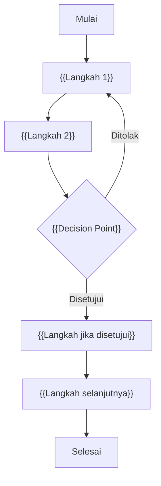
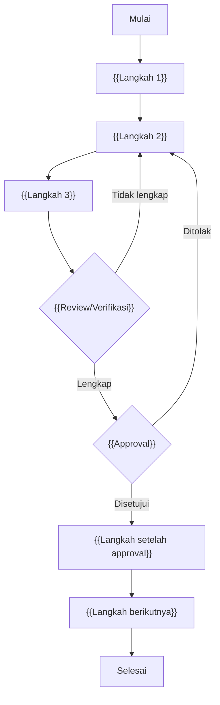
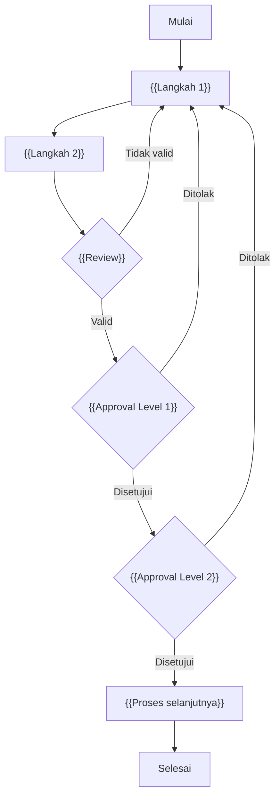
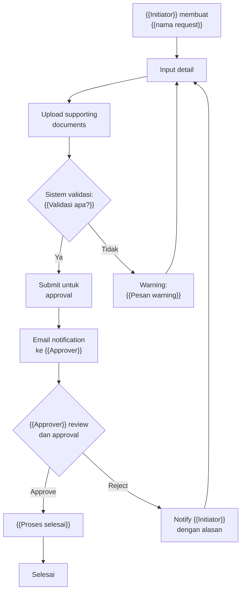
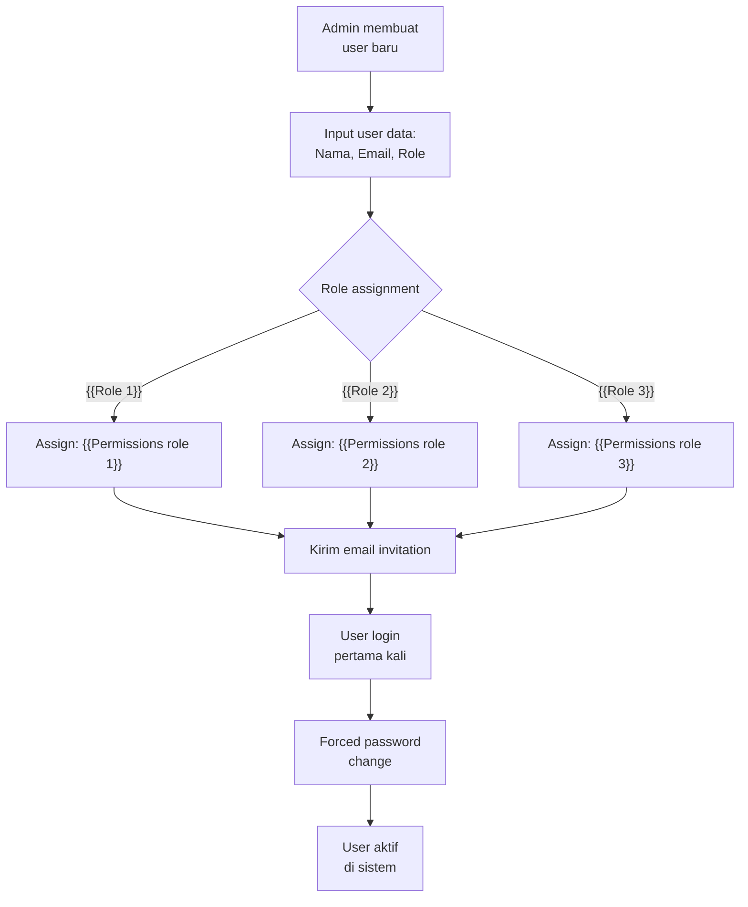

# Business Process Model and Notation (BPMN)
# {{NAMA_PROYEK}}

## 1. Alur Proses Utama (To-Be)

### 1.1 Flow Umum — {{Nama Proses Utama}}

### 1.2 Flow {{Nama Sub-Proses 1}}

### 1.3 Flow {{Nama Sub-Proses 2}}

## 2. Alur Approval — {{Nama Proses Approval}}

## 3. Alur User Registration & Access (To-Be)

> [!NOTE]
> Diagram As-Is (proses saat ini) dapat ditambahkan jika informasi tersedia. Gunakan format mermaid flowchart yang sama untuk konsistensi.
