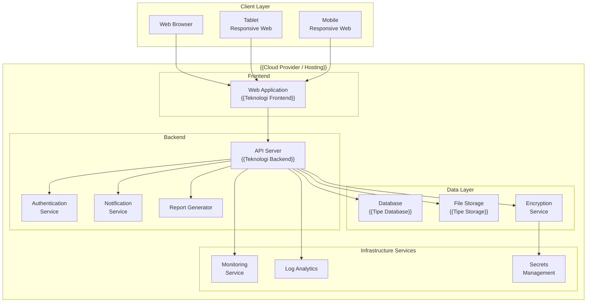
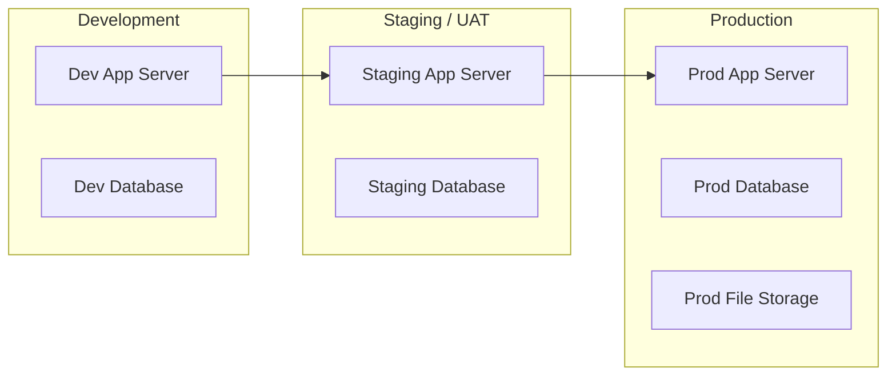

# System Architecture Design
# {{NAMA_PROYEK}}

## 1. Arsitektur Tingkat Tinggi

## 2. Komponen Utama

### 2.1 Frontend Layer
| Komponen | Teknologi | Fungsi |
|----------|-----------|--------|
| Web Application | {{HTML5, CSS3, JS / React / Vue / dll}} | {{Fungsi utama frontend}} |
| Responsive Design | {{Framework CSS}} | Cross-platform compatibility |
| Charts & Visualisasi | {{Library chart}} | Dashboard dan grafik |

### 2.2 Backend Layer
| Komponen | Teknologi | Fungsi |
|----------|-----------|--------|
| API Server | {{Node.js / Laravel / .NET / dll}} | Business logic, REST API |
| Authentication | {{JWT / OAuth / dll}} | Login, session, role management |
| Notification Service | {{SMTP / Provider}} | Email notifications |
| Report Generator | {{Library PDF/Excel}} | Generate reports |

### 2.3 Data Layer
| Komponen | Teknologi | Fungsi |
|----------|-----------|--------|
| Database | {{MySQL / PostgreSQL / dll}} | Data utama |
| File Storage | {{Cloud Storage / Local}} | Document storage |
| Encryption | {{AES-256 / dll}} | Data encryption |

### 2.4 Infrastructure Services
| Komponen | Fungsi |
|----------|--------|
| {{Hosting Service}} | Hosting web application |
| {{Database Service}} | Managed database |
| {{Storage Service}} | File dan document storage |
| {{Monitoring Service}} | Performance monitoring |

## 3. Integrasi Pihak Ketiga

| Sistem | Tipe Integrasi | Tujuan |
|--------|----------------|--------|
| {{Sistem 1}} | {{API/SDK/Manual}} | {{Tujuan integrasi}} |
| {{Sistem 2}} | {{API/SDK/Manual}} | {{Tujuan integrasi}} |

## 4. Lingkungan Server

| Environment | Tujuan | Access |
|-------------|--------|--------|
| Development | Pengembangan dan testing developer | Dev team only |
| Staging/UAT | User Acceptance Testing | Dev team + selected users |
| Production | Live system | All authorized users |

## 5. Teknologi Stack

| Layer | Teknologi | Justifikasi |
|-------|-----------|-------------|
| Frontend | {{Teknologi}} | {{Alasan pemilihan}} |
| Backend | {{Teknologi}} | {{Alasan pemilihan}} |
| Database | {{Teknologi}} | {{Alasan pemilihan}} |
| Cloud | {{Provider}} | {{Alasan pemilihan}} |
| Security | {{Teknologi}} | {{Alasan pemilihan}} |
| Monitoring | {{Teknologi}} | {{Alasan pemilihan}} |

## 6. Non-Functional Requirements

| Aspek | Target | Implementasi |
|-------|--------|-------------|
| Performance | {{Target response time}} | {{Strategi implementasi}} |
| Availability | {{Target uptime %}} | {{Strategi implementasi}} |
| Security | {{Standar keamanan}} | {{Teknologi yang digunakan}} |
| Scalability | {{Target skalabilitas}} | {{Strategi implementasi}} |
| Backup | {{Kebijakan backup}} | {{Strategi backup}} |
| DR | {{RPO/RTO target}} | {{Strategi DR}} |
