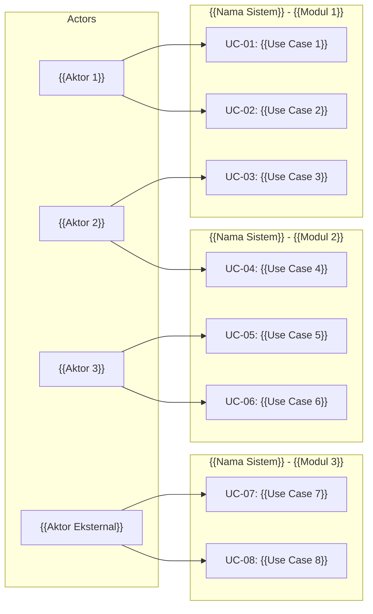

# Use Case Diagram
# {{NAMA_PROYEK}}

## Daftar Aktor

| Aktor | Deskripsi | Tipe |
|-------|-----------|------|
| {{Aktor 1}} | {{Deskripsi peran}} | Primary |
| {{Aktor 2}} | {{Deskripsi peran}} | Primary |
| {{Aktor 3}} | {{Deskripsi peran}} | Primary |
| {{Aktor Eksternal 1}} | {{Deskripsi sistem eksternal}} | Secondary |

## Use Case Diagram

## Detail Use Case

### UC-01: {{Nama Use Case}}
- **Aktor Utama:** {{Aktor}}
- **Pre-condition:** {{Kondisi yang harus terpenuhi sebelum use case dijalankan}}
- **Post-condition:** {{Kondisi setelah use case berhasil dijalankan}}
- **Main Flow:** {{Langkah utama: Login → Aksi 1 → Aksi 2 → Hasil}}

### UC-02: {{Nama Use Case}}
- **Aktor Utama:** {{Aktor}}
- **Include:** {{UC terkait yang selalu dijalankan (opsional)}}
- **Pre-condition:** {{Kondisi prasyarat}}
- **Post-condition:** {{Kondisi akhir}}

### UC-03: {{Nama Use Case}}
- **Aktor Utama:** {{Aktor}}
- **Extend:** {{UC terkait yang opsional dijalankan (opsional)}}
- **Pre-condition:** {{Kondisi prasyarat}}
- **Post-condition:** {{Kondisi akhir}}
- **Generalization:** {{Variasi berdasarkan role, jika ada}}

> [!NOTE]
> Tambahkan use case sesuai kebutuhan proyek. Gunakan relasi **Include** untuk use case yang selalu dipanggil, **Extend** untuk yang opsional, dan **Generalization** untuk variasi berdasarkan role.
