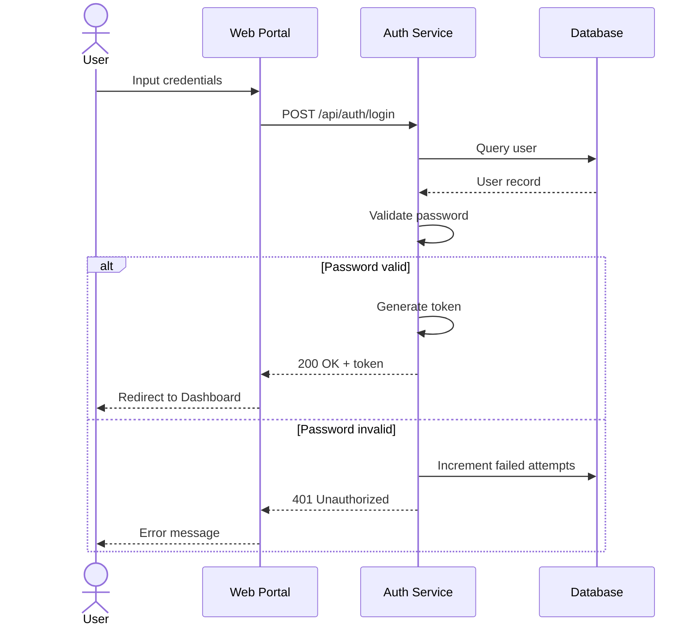
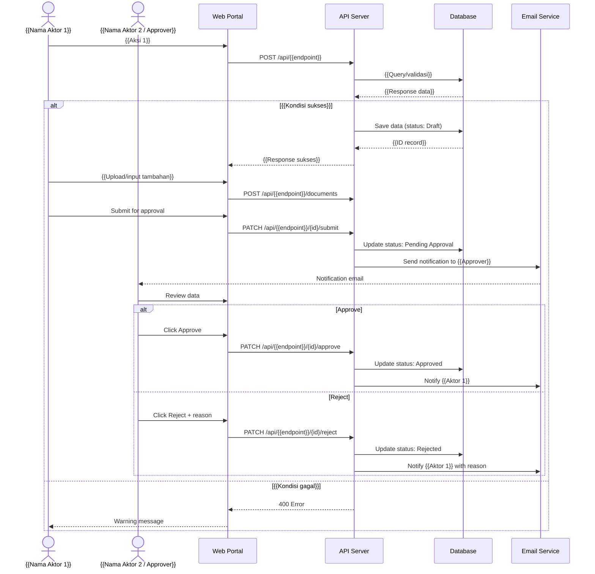
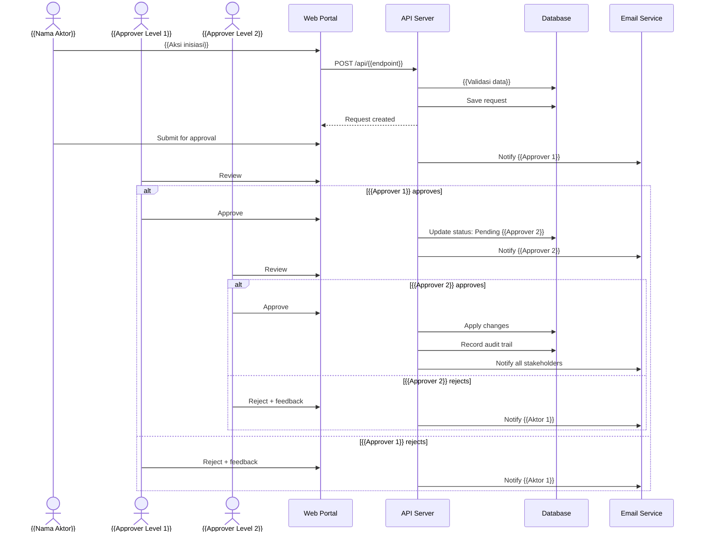
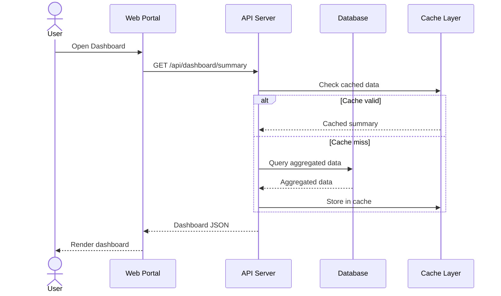

# Sequence Diagram
# {{NAMA_PROYEK}}

## 1. Sequence: Login Flow

## 2. Sequence: {{Nama Proses Utama 1}}

## 3. Sequence: {{Nama Proses Utama 2}}

## 4. Sequence: Dashboard Data Loading

> [!NOTE]
> Tambahkan atau ubah sequence diagram sesuai proses bisnis utama dari proyek. Pastikan setiap sequence menunjukkan interaksi antar aktor, sistem, dan database.
