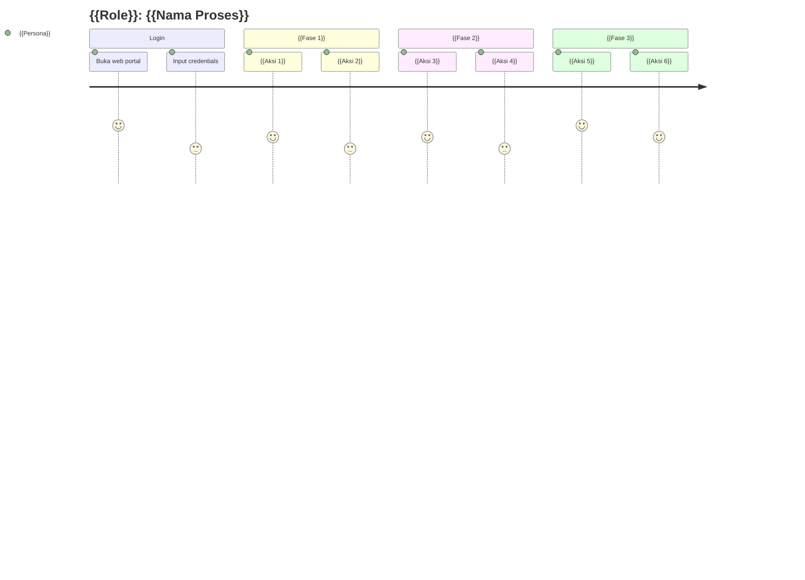

# User Journey Map
# {{NAMA_PROYEK}}

---

## Journey 1: {{Nama Role}} — {{Nama Proses}}

**Persona:** {{Nama Persona}} ({{Role}}, {{Organisasi}})
**Tujuan:** {{Tujuan akhir user dalam journey ini}}

| Tahap | Aksi Pengguna | Touchpoint | Ekspektasi | Pain Points |
|-------|---------------|------------|------------|-------------|
| 1. Login | Input email & password | Halaman Login | Login cepat < 3 detik | Lupa password → perlu recovery |
| 2. {{Tahap 2}} | {{Aksi}} | {{Halaman/fitur}} | {{Harapan user}} | {{Masalah potensial}} |
| 3. {{Tahap 3}} | {{Aksi}} | {{Halaman/fitur}} | {{Harapan user}} | {{Masalah potensial}} |
| 4. {{Tahap 4}} | {{Aksi}} | {{Halaman/fitur}} | {{Harapan user}} | {{Masalah potensial}} |
| 5. {{Tahap 5}} | {{Aksi}} | {{Halaman/fitur}} | {{Harapan user}} | {{Masalah potensial}} |
| 6. Selesai | {{Aksi akhir}} | {{Halaman/fitur}} | {{Harapan}} | - |

---

## Journey 2: {{Nama Role 2}} — {{Nama Proses 2}}

**Persona:** {{Nama Persona 2}} ({{Role}}, {{Organisasi}})
**Tujuan:** {{Tujuan akhir user}}

| Tahap | Aksi Pengguna | Touchpoint | Ekspektasi | Pain Points |
|-------|---------------|------------|------------|-------------|
| 1. {{Tahap}} | {{Aksi}} | {{Touchpoint}} | {{Ekspektasi}} | {{Pain point}} |
| 2. {{Tahap}} | {{Aksi}} | {{Touchpoint}} | {{Ekspektasi}} | {{Pain point}} |
| 3. {{Tahap}} | {{Aksi}} | {{Touchpoint}} | {{Ekspektasi}} | {{Pain point}} |
| 4. {{Tahap}} | {{Aksi}} | {{Touchpoint}} | {{Ekspektasi}} | {{Pain point}} |

---

## Journey 3: {{Nama Role 3}} — {{Nama Proses 3}}

**Persona:** {{Nama Persona 3}} ({{Role}}, {{Organisasi}})
**Tujuan:** {{Tujuan akhir user}}

| Tahap | Aksi Pengguna | Touchpoint | Ekspektasi | Pain Points |
|-------|---------------|------------|------------|-------------|
| 1. {{Tahap}} | {{Aksi}} | {{Touchpoint}} | {{Ekspektasi}} | {{Pain point}} |
| 2. {{Tahap}} | {{Aksi}} | {{Touchpoint}} | {{Ekspektasi}} | {{Pain point}} |
| 3. {{Tahap}} | {{Aksi}} | {{Touchpoint}} | {{Ekspektasi}} | {{Pain point}} |

---

> [!NOTE]
> Buat satu journey map untuk setiap proses utama per role. Skor pada mermaid journey chart berkisar 1-5 (1 = sangat buruk, 5 = sangat baik) untuk menggambarkan pengalaman user di setiap tahap.
